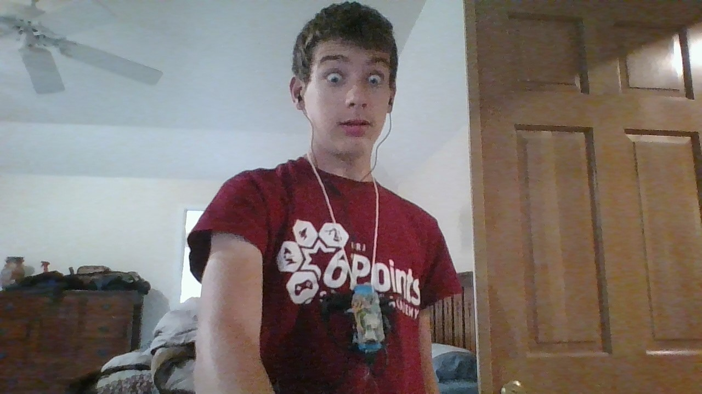

# piband

The Piband is a wearable DIY open-source personal assistant made with a Raspberry Pi that can that can do the following for its users:

-Set timers/alarms

-time/date

-Dictionary/thesaurus

-XKCD transcripts

-Music

-Summoning Cthulu (reads the call of Cthulu in a loud scary voice)

-News

-Chatbot

-3rd party scripts

-Translate

-Email

-General Knowledge questions (e.g. "what's the capital of Australia", "how many ounces in a cup")

And much, much more coming soon!

To enable emails, make a file in the SRC directory called "fromaddr" with your email and "emailpass" with your password. If you are using Gmail (I'm sure other email providers will make you do this too), make sure to enable less secure apps. To make a contact, make a file in the src directory THAT IS ALL LOWER CASE with the name of the contact as the title and their email address as the content of the file. After all of that, simply say to the PiBand, "Send an email to [contact] saying [your message]." The PiBand will then send the email.

And this is a list of all the API's I use:

-[Yandex Translate](http://translate.yandex.com)

-[Big huge Thesaurus](https://words.bighugelabs.com/api.php)

-[Dictionary.reference.com](https://dictionary.reference.com)

-[Wolfram Alpha](https://www.wolframalpha.com/)

-[Xkcd API](https://xkcd.com)

-[Newsapi.org](https://newsapi.org)

The Piband is open source and fully customizable and additional scripts can be made by either editing the source code locally or creating python scripts, for example the [news script](https://github.com/bobmonkeywarts/piband/blob/master/src/news.py). This script is in a seperate file and can be started by the main script, piband.py. Then, when the user says "script news", it runs your custom script, making it an ideal platform for makers who want to add on to their virtual assistants.

Video at https://tinyurl.com/the-piband! Github repository at https://github.com/bobmonkeywarts/piband.

August 11 edit: The Piband will be in the Seattle Mini Maker faire! After days of work, I have rebuilt the prototype but smaller and more compact (battery life is worse but shut up.) This is a picture of me wearing it:

